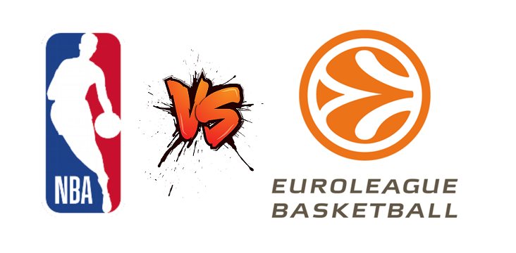

# Comparing NBA and Euroleague Basketball

## Table of Contents
1. How to Access the Project
2. Project Description
3. Outline of Jupyter notebooks
4. Insights Unlocked

## How to Access the Project

To obtain the best rendering results and make sure all the internal links work properly, it is recommended to open the provided notebooks using the [Jupyter nbviewer](https://nbviewer.org/) service. Direct links to the notebooks rendered this way are provided clicking on each notebook's title in the outline section below.

## Project Description

We draw a comparison between the two main professional basketball leagues in the USA and Europe: the NBA and the Euroleague, respectively. More precisely, we scrape from the internet both statistical and biographical data of players and teams who participated in one of those two leagues between 2016 and 2020. The goal of the project is to expose ways in which the two leagues might differ. In particular, we try to answer the following questions:

- What is the geographical composition of the NBA and the Euroleague? In other words, what country (or, more generally, what continent) do the majority of players in each league come from?
- How do other biographical data compare across the two leagues? For example, do players in the NBA tend to be younger, taller or heavier than players in the Euroleague?
- If we look at players' and teams' stats across the two leagues, do we observe any clear disparity? 
- Can we use the answers to the previous two questions to differentiate the styles of play in the NBA and in the Euroleague? 
- Are there any specific factors that seem to contribute to the success of a team? If yes, are these factors the same in both leagues or do they change wildly?

## Outline of Jupyter notebooks

1. [**Part 1 - Data_Scraping**](https://nbviewer.org/github/gb-pignatti/NBAvsEL/blob/main/Part%201%20-%20Data_Scraping.ipynb): We scrape the basketball data that will be used in the later parts of the project. The data comes from two main sources: [BasketballReference.com](https://www.basketball-reference.com/) for the NBA and [RealGM.com](https://basketball.realgm.com/international/league/1/Euroleague/home) for the Euroleague. The scraping code relies for the most part on the `requests` library and the `Beautiful Soup` parser. In the end, the collected data appears across 9 different tables, 4 for the NBA and 5 for the Euroleague.
2. [**Part 2 - Data_Cleaning**](https://nbviewer.org/github/gb-pignatti/NBAvsEL/blob/main/Part%202%20-%20Data_Cleaning.ipynb): We clean, uniformize and merge the data we scraped in the previous part. Since games in the NBA last 48 minutes and in the Euroleague only 40 minutes, one of the focal points is finding a good normalization method for the statistical data. We decide to use the per 40-minutes ratings system. To uniformize the players' geographical data we resort to an auxiliary DataFrame. In the end, we have 2 DataFrames, one containing all the players' data and one containing all the teams' data.    
3. [**Part 3 - Data_Analysis**](https://nbviewer.org/github/gb-pignatti/NBAvsEL/blob/main/Part%203%20-%20Data_Analysis.ipynb): This is the main part of the project. We perform a comparative analysis of the NBA and Euroleague using data visualization. We mostly use kernel density plots with an added median for the statistical columns and paired barplots for the categorical columns but other kind of graphs are also used when appropriate (violin plots, lollipop plots, line plots...). In the end, we are able to find good answers to the questions we posed above.

## Insights Unlocked

At the conclusion of our analysis we observe that:
- Most of the players in both leagues come from the USA. Among the other popular countries, we find Canada and Australia in the NBA and, in the Euroleague, a group of four-five European nations led by France. In fact, when considered as a single group, European players in the Euroleague outnumber Americans.    
- Players in the NBA are overall younger than the ones in the Euroleague. More specifically, roughly half of the NBA players are younger than 26 while in the Euroleague this threshold increases to 29 years old.
- Players in the NBA are on average a few kilos heavier than the ones in the Euroleague. There's not much difference between the heights of players in the two leagues. However, starting from 2019, the median weight and height of NBA players have decreased slightly.  
- The NBA has a much higher density of top scorers, which is to say, players who score a lot of points (at least 25 points per 40-minutes). As a consequence, the points production of NBA teams is mostly based on the skills of a handful of offensively talented players, while in the Euroleague teams' points are more uniformly distributed among all the team members.
- In the NBA it is easier to pinpoint a small group of bad teams with losing records while in the Euroleague Winning Percentages are normally distributed. This might have to do with the different format of the two leagues.    
- Teams in the NBA score about 10 more Points than teams in the Euroleague but at the same time attempt at least 10 more Field Goals per 40-minutes. One of the factors that causes this imbalance is that the average number of NBA teams' 3-Point Attempts has grown steadily over the period of time we are considering. This last observation could also explain the heights' and weights' trends we mentioned above.  
- As a consequence of the higher number of Field Goal Attempts (hence of both shots made and missed), NBA teams tend to have more Rebounds and more Assists than teams in the Euroleague. 
- Teams' Winning Percentages in the Euroleague are positively correlated with Points. This means that teams which score a lot of points tend to win more games. In the NBA, because of the higher density of top scorers, this assumption fails to be valid.
- Teams in the Euroleague make more Turnovers than teams in the NBA. This could possibly be a sign that defenses in the Euroleague are more smothering. Such assumption would also explain the higher number of Field Goal Attempts (and Points) in the NBA.   
